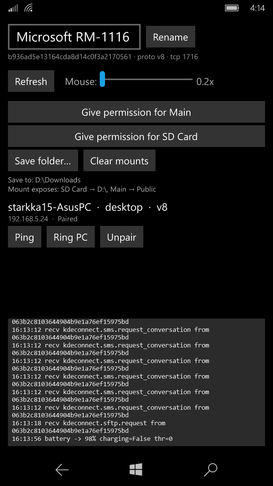

# Konnect UWP

A [KDE Connect](https://kdeconnect.kde.org/) client for **Windows 10 Mobile** (UWP, ARM).
It lets a Windows phone talk to a desktop running any KDE Connect implementation —
[KDE Connect](https://kdeconnect.kde.org/), [GSConnect](https://github.com/GSConnect/gnome-shell-extension-gsconnect),
or Zorin Connect — over the local network: pair, share files, mirror notifications, browse
the phone's storage, and more.

It speaks KDE Connect **protocol v8** natively (UDP/TCP 1716, TLS with per-role certificates),
so no companion app or bridge is needed on the desktop — your existing KDE Connect / GSConnect
sees the phone like any other device.

  

---

## What works

| Feature | Direction | Notes |
|---|---|---|
| **Pairing** | ↔ | Certificate pairing with SHA-256 verification key |
| **Battery** | phone → PC | Level + charging state |
| **Ping** | ↔ | |
| **Find My Phone / Ring** | ↔ | Ring the PC from the phone, and ring the phone from the PC (works on the lock screen) |
| **Clipboard** | ↔ | Auto-sync clipboard text |
| **Share** | ↔ | Send/receive files, text, and URLs. Received files land in a folder **you choose** (see below) |
| **Notifications** | phone → PC | Mirrors the phone's notifications to the desktop |
| **SMS** | phone → PC | **Read-only** — conversation history shows on the desktop (see caveats) |
| **SFTP / Mount** | phone → PC | Browse the phone's storage from the desktop's file manager, with folders **you grant** |
| **Remote input** | **PC → phone** | Control the *phone's* pointer & keyboard from the desktop, with an adjustable mouse-sensitivity slider |

## Not implemented (yet) / caveats

- **Mouse + keyboard from the phone to the computer is _not_ implemented.** Using the phone
  as a touchpad/keyboard to drive the *PC* isn't built yet. The "Remote input" that works today
  is the other direction — the desktop controlling the phone.
- **SMS is read-only.** Windows 10 Mobile restricts programmatic SMS sending to privileged apps,
  so composing/sending from the desktop isn't possible. History display works.
- **Background/always-on is limited.** W10M suspends backgrounded apps (there's no
  foreground-service equivalent), so the connection may drop when the app isn't in the
  foreground. Bring it back up and it reconnects.
- Not every KDE Connect plugin is present (no media control / MPRIS, run-command, remote
  keyboard-from-phone, etc.). What's listed above is what's implemented.

---

## Using it

### Install
Sideload the signed `.appx` from the [latest release](../../releases/latest) onto a Windows 10
Mobile device (developer mode enabled). It targets `10.0.16299` with a minimum of `10.0.15063`.

### Pair
1. Make sure the phone and desktop are on the **same network**.
2. Open Konnect UWP — the desktop's KDE Connect / GSConnect should list the phone (tap **Refresh**
   if not).
3. Start pairing from either side and accept. Both show a matching **verification key** — confirm
   it matches, then accept.

### Rename the device
The name shown to the desktop defaults to the phone's model. Type a new name and tap **Rename**.

### Share files
- **Phone → PC:** use the desktop's KDE Connect "Send file" as usual.
- **PC → phone:** received files are saved to the folder set by **Save folder…**. If you haven't
  picked one, they go to `Pictures\Konnect` (browsable in the Files app). A toast shows transfer
  progress.

### Browse the phone's files from the desktop (SFTP / Mount)
Because W10M can't grant broad filesystem access to an app, **you choose which folders to expose**
(the UWP equivalent of Android's storage-access prompt — no special permissions, works within the
sandbox):

1. Tap **Give permission for Main** and pick your internal-storage folder → it's exposed as **Main**.
2. Tap **Give permission for SD Card** and pick the SD-card root → it's exposed as **SD Card**.
   *(The button decides the name — "Main" / "SD Card" — regardless of the folder's real name.)*
3. On the desktop, use KDE Connect / GSConnect **Browse Files**. The mount shows your granted
   folders. **Clear mounts** reverts to the default media libraries (Pictures/Music/Videos).

### Mouse control (desktop → phone)
Under **Mouse:** drag the sensitivity slider. The desktop's remote-input then moves the phone's
pointer and types into it.

---

## Building from source

Built on Windows with Visual Studio 2022 (v142 toolset) + the Windows 10 SDK. Because it targets
Windows 10 Mobile:

- **`TargetPlatformMinVersion` must be `10.0.15063.0`** (built against 16299) or it won't install.
- The project uses a **vendored, patched BouncyCastle** (`ZorinConnect.UWP/libs/BouncyCastle.Crypto.dll`)
  for TLS in *both* client and server roles — WinRT's `UpgradeToSslAsync` is client-only, and stock
  BouncyCastle crashes on some GnuTLS handshakes. Do not replace it with the NuGet build.
- Dependencies are pinned to what other working W10M UWP apps use: UWP 6.1.9, Newtonsoft.Json 13.0.3.

`build.ps1` builds Release|ARM and packs a signed `.appx`. `deploy.py` installs it over the
Windows Device Portal (set `ZC_HOST` and provide a WDP pairing cookie via `ZC_WMID` or a local
`.wmid` file).

---

## Credits & licensing

- **KDE Connect** — the protocol this implements. © the KDE Community.
- **Zorin Connect** — the Android source this UWP port was studied against (itself a KDE Connect fork).
- **BouncyCastle** — the managed crypto (patched build vendored in-tree; upstream license respected).

This project reimplements the KDE Connect protocol for UWP; it is **not** affiliated with or
endorsed by KDE, Zorin, or GSConnect.

## AI disclosure

This project is developed with heavy AI assistance. See [AI.md](AI.md) for the honest details.
